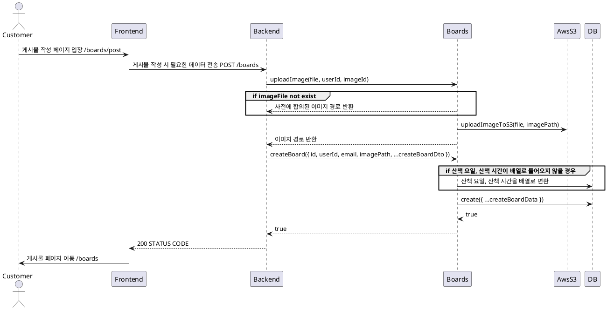

# 게시물 등록 프로세스

### 유스케이스 명: 게시물 등록 (Post boards)

**선행 조건**:

- 고객이 시스템에 로그인되어 있어야 한다.

**기본 흐름**:

1. 고객이 시스템에 로그인한다.
2. 고객이 게시물을 작성한다.
3. 게시물은 필수 정보를 담아야한다.
   - 제목
   - 주소
   - 산책 요일
   - 산책 시간
   - 설명
4. 프론트엔드는 필수 정보를 담아 백엔드에 요청을 보낸다.
5. 백엔드는 받은 데이터 처리 후 200 STATUS CODE를 반환한다.

**대안 흐름**:

**후행 조건**:

**특별 요구 사항**:

- 게시물을 작성할 때, 이미지 데이터를 프론트에서 받지 못한 경우 사전 합의된 이미지 데이터를 저장한다.
- 산책 요일, 산책 시간은 fileData에 담겨서 들어온다.
  - 하나만 들어올 경우엔 문자열로 들어오고, 둘 이상 들어올 경우엔 배열로 들어온다.
  - 프론트 측에서 해결하지 못한 케이스여서 백엔드에서 처리한다.

**비즈니스 규칙**:

- 게시물 작성시 한 번에 두 번 작성될 수 없다.

