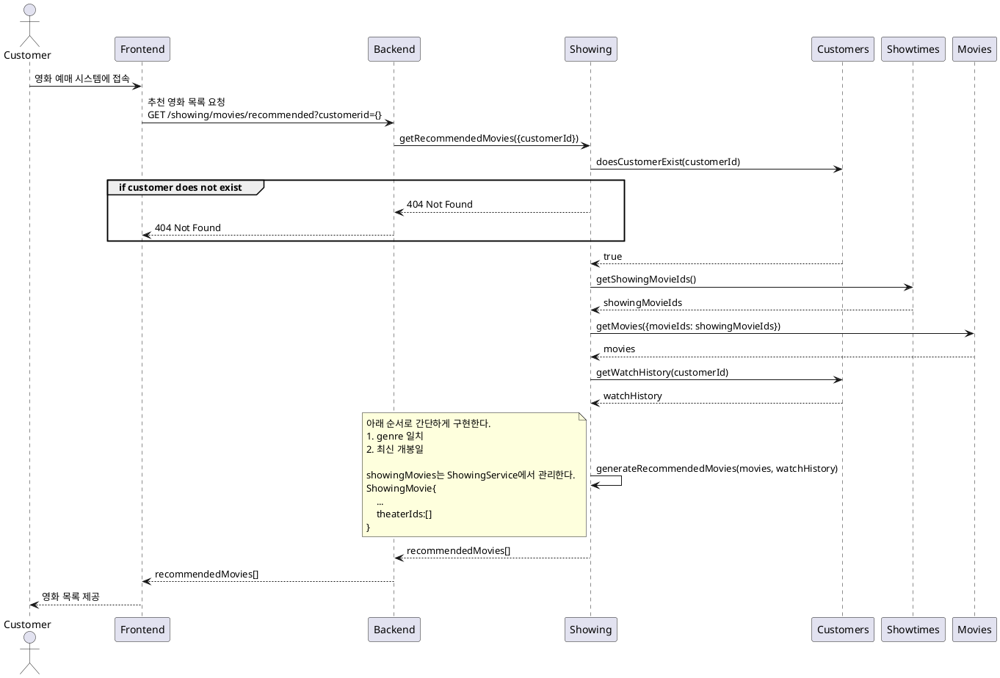

# 티켓 구매 프로세스

### 유스케이스 명: 티켓 구매 (Tickets Purchase)

**선행 조건**:

- 고객이 시스템에 로그인되어 있어야 한다.
- 원하는 영화와 극장의 상영 시간 및 좌석이 사용 가능해야 한다.

**기본 흐름**:

**대안 흐름**:

- A1. 원하는 상영 시간이나 좌석이 사용 불가능한 경우:
- 시스템은 사용 불가능한 메시지를 표시하고, 다른 상영 시간이나 좌석을 선택하도록 유도한다.
- A2. 결제가 실패한 경우:
- 시스템은 결제 실패 메시지를 표시하고, 결제 정보를 재입력하거나 다른 결제 방법을 선택하도록 유도한다.

**후행 조건**:

- 고객은 구매한 티켓에 대한 전자 티켓을 이메일로 받는다.
- 시스템은 구매된 티켓의 좌석을 사용 불가능으로 업데이트한다.

**특별 요구 사항**:

- 시스템은 결제 처리를 위해 외부 결제 게이트웨이(PaymentGateway)와 통신해야 한다.
- 시스템은 고객이 선택한 좌석이 동시에 다른 고객에게 판매되지 않도록 동시성 관리를 해야 한다.
- 모든 통신은 보안 프로토콜을 통해 이루어져야 한다.

**비즈니스 규칙**:

- 고객은 한 번에 최대 10장의 티켓을 구매할 수 있다.
- 상영 30분 전까지만 온라인으로 티켓을 구매할 수 있다.

